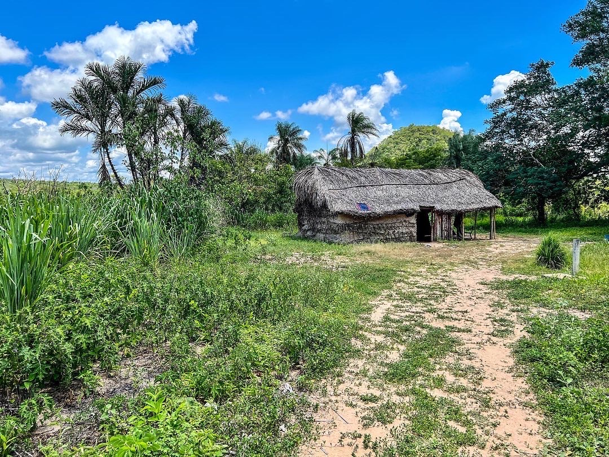
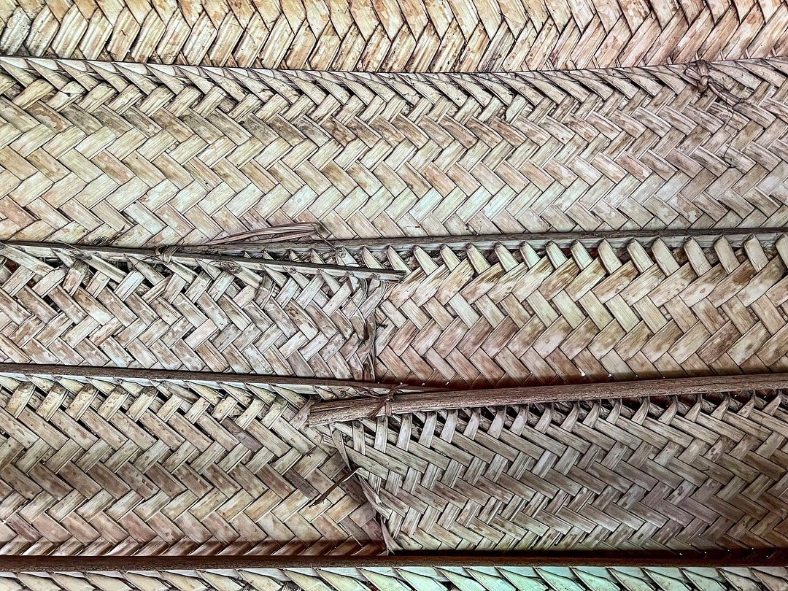
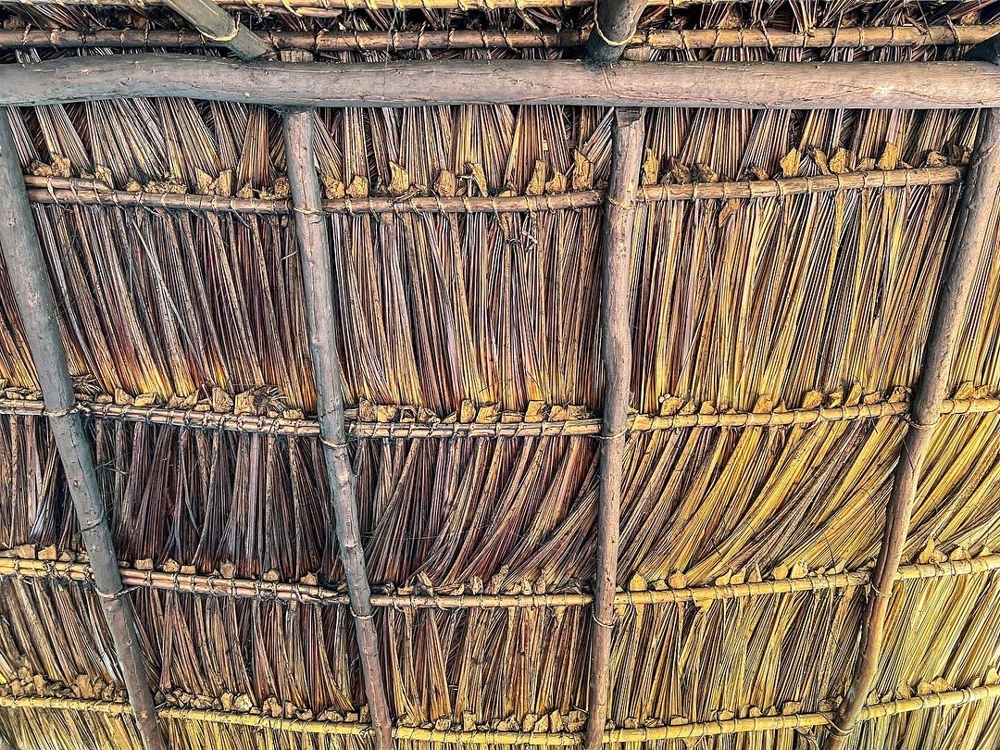

English:

# Projeto de Revitalização da língua Bororo

O projeto de revitalização da língua Bororo tem como seu objetivo principal fazer com que a língua seja falada com mais frequência na terra indígena Merure, tanto pelos adultos, como pelas crianças, já que muitas tem somente um conhecimento passivo da língua.

 

<figure align="center" >
  
    <figcaption>Casa tradicional Bororo. Foto: Fabrício Gerardi (Meruri, Novembro 2022)</figcaption>
</figure>

 
 

## Quem? 

O projeto de revitalização do Bororo é uma parceria entre a comunidade Bororo, representatda pelos professores Kujibo (Mariel) Ekureu e Lauro Ekureu, juntamente com Fabrício Ferraz Gerardi (Universidade de Tübingen), Carolina Aragon (Universidade Federal da Paraíba), Tim Wientzek (Universidade de Tübingen), e Padre Tiago Figueiró (SDB).

 

<figure align="center">
  
   <figcaption>Parede de casa tradicional Bororo. Foto: Fabrício Gerardi (Meruri, Novembro 2022)</figcaption>
</figure>

 
 

## O que planejamos produzir?

* Gramática de referência do Bororo / Bororo reference grammar (Versão em Inglês e Português, online e impressa)
* Dicionário Bororo (versão online em CLDF)
* Proposta de ortografia para a língua
* Livros de alfabetização em Bororo
* Modernização de materiais já exitentes
* Criação de artigos em Bororo na Wikipedia
* [Banco de árvore da língua Bororo](https://github.com/UniversalDependencies/UD_Bororo-BDT/tree/dev) com mitos, histórias, material de pesquisa de campo, e outros textos (com tradução para o inglês e para o português)
* Workshops com a comunidade
* Promoção da cultura bororo

 

<figure align="center" >
  
    <figcaption>Teto de casa tradicional Bororo. Foto: Fabrício Gerardi (Meruri, Novembro 2022)</figcaption>
</figure>

 
 

